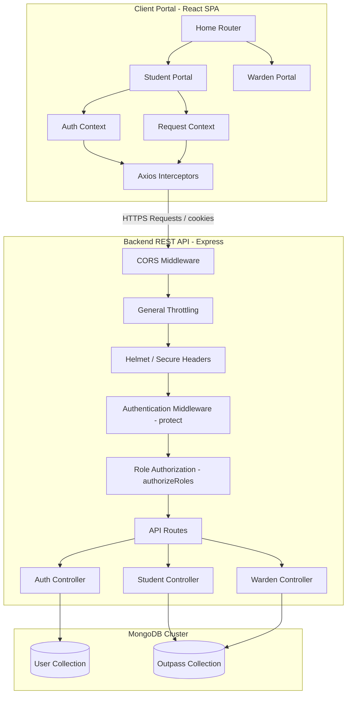

# NITH Outpass Management System

A production-grade, secure, role-based Outpass Management System designed for the students and hostel wardens of the National Institute of Technology Hamirpur (NITH). This repository contains both the client-side single-page application (SPA) and the RESTful backend API service.

---

# Project Overview

### What the Project Does
The NITH Outpass Management System automates the traditional, manual paper-slip process of issuing, tracking, and validating student outpasses (gatepasses). It enables students to apply for leave permissions electronically, allows wardens to audit and decide on requests for their specific hostels, and displays clear visual timelines and verifiable gatepass printouts once approved.

### Problem It Solves
1. **Inefficient Processing:** Eliminates manual physical form submission and signature hunting.
2. **Lack of Audit Trails:** Provides a persistent database log of past, current, and pending outpasses.
3. **Security Vulnerabilities:** Prevents unauthorized gate exits and forged warden signatures. Approved passes display structured verification data encoded inside a scan-ready QR code.
4. **Hostel Isolation:** Ensures wardens can only view and manage student requests corresponding to their own designated hostels.

### Target Users
- **Students:** Apply for outpasses, monitor validation status, and download/print approved gatepasses.
- **Hostel Wardens:** Review pending outpass applications, audit applicant history, and approve or reject passes.
- **Security Guards:** (Conceptual/Future) scan and confirm student exit/entry permissions at gates. *Note: The guard scanning interface is not yet implemented in the current codebase.*

### Real-World Workflow
```
[Student Logs In] ➔ [Submits Outpass Form] ➔ [Status: Pending]
                                                     │
                                                     ▼
[Warden Logs In] ➔ [Sees Hostel Requests] ➔ [Approves / Rejects Outpass]
                                                     │
               ┌─────────────────────────────────────┴─────────────────────────────────────┐
               ▼                                                                           ▼
       [Status: Rejected]                                                          [Status: Approved]
               │                                                                           │
               ▼                                                                           ▼
   [Displays Stepper Timeline]                                              [Timeline Stepper Highlights Exit]
                                                                            [Generates Student Exit QR Code]
                                                                            [Prints Official Outpass Voucher]
```

---

# System Architecture

The project is structured as a decoupled client-server architecture. 

### Architecture Diagram


### Frontend Architecture
- **Framework:** React SPA bootstrapped with Vite.
- **Routing:** Handled declaratively in [App.jsx](file:///c:/Users/Satvik/OneDrive/Desktop/OutpassSystem/client/src/App.jsx) via React Router DOM.
- **State Management:** Handled locally within standard React states and shared globally through Context providers:
  - [AuthContext.jsx](file:///c:/Users/Satvik/OneDrive/Desktop/OutpassSystem/client/src/context/AuthContext.jsx): Handles login, signup, session tokens, and local storage.
  - [RequestContext.jsx](file:///c:/Users/Satvik/OneDrive/Desktop/OutpassSystem/client/src/context/RequestContext.jsx): Drives fetching, creating, and listing outpasses.
- **HTTP client:** Axios, customized with interceptors in [axiosInstance.js](file:///c:/Users/Satvik/OneDrive/Desktop/OutpassSystem/client/src/api/axiosInstance.js) to append headers and automatically manage JWT refresh token rotations.

### Backend Architecture
- **Framework:** Node.js server powered by Express.
- **Security Middlewares:** 
  - `cors`: Handles origin filtering across local development ports (`5173`, `5174`, `3000`).
  - `helmet`: Enhances HTTP response headers for protection against Clickjacking, XSS, and MIME-sniffing.
  - `express-rate-limit`: Throttles APIs. general endpoints (100 req/min), auth endpoints (20 req/15 min).
- **Authentication & JWT:** Custom `protect` and `authorizeRoles` middlewares in [authMiddleware.js](file:///c:/Users/Satvik/OneDrive/Desktop/OutpassSystem/outpassSystemBackend/middlewares/authMiddleware.js) verify access tokens and route permissions.
- **Logging:** Structured logs generated by Winston in [logger.js](file:///c:/Users/Satvik/OneDrive/Desktop/OutpassSystem/outpassSystemBackend/lib/logger.js).

---

# Technology Analysis

| Technology / Dependency | Location | Why It Is Used | Impact of Removal |
| :--- | :--- | :--- | :--- |
| **React & React DOM** | Frontend | Powers component layouts, state transitions, and client page lifecycle. | Frontend would fail to render; requires complete rewrite. |
| **Vite** | Frontend | Compiles code bundles, handles hot-module reloading (HMR) and assets. | Slower developer iteration; manual webpack configurations needed. |
| **React Router DOM** | Frontend | Enables client-side path changes without triggering full document requests. | Navigation falls back to server-rendered browser loads. |
| **Axios** | Frontend | Performs HTTP REST requests; handles cookie exchanges and retry loops. | Manual fetch API wrappers must be constructed. |
| **React Select** | Frontend | Renders the searchable hostel select list on registration. | Falls back to generic non-searchable select lists. |
| **React Toastify** | Frontend | Renders clean visual alert cards. | Errors/success actions must fall back to default alerts. |
| **Express** | Backend | Drives request routing, server pipeline execution, and controllers. | Server requires manual Node HTTP module handling. |
| **Mongoose** | Backend | Schema definitions, strict validation, and model indexing on MongoDB. | DB layer must write raw native MongoDB query strings. |
| **JSON Web Token (JWT)** | Backend | Generates signed authentication payloads for users. | Falls back to server-side session stores, increasing memory usage. |
| **BcryptJS** | Backend | Hashes user passwords with salt rounds prior to saving to database. | Passwords would be stored in plain text, presenting massive security leaks. |
| **Nodemailer** | Backend | Connects to SMTP hosts to dispatch OTPs and reset tokens. | OTPs and password resets would fail to reach users. |
| **Winston** | Backend | Implements structured console and transport logging. | Log tracing must fall back to basic `console.log`. |
| **Helmet** | Backend | Standardizes HTTP security headers. | Exposes server header data and increases cross-site risks. |

---

# Folder Structure Deep Analysis

```
OutpassSystem/
├── client/                     # Frontend Application
│   ├── public/                 # Static files
│   ├── src/                    # Source Directory
│   │   ├── api/                # Axios wrappers for API integration
│   │   │   ├── authAPI.js      # Auth-related server calls
│   │   │   ├── studentAPI.js   # Student-related server calls
│   │   │   ├── wardenAPI.js    # Warden-related server calls
│   │   │   └── axiosInstance.js # Customized Axios instance with token refresh interceptors
│   │   ├── components/         # Reusable layouts (Navbar, StatusBadge)
│   │   ├── context/            # Context API providers (AuthContext, RequestContext)
│   │   ├── pages/              # Portal pages
│   │   │   ├── auth/           # Login/Signup forms and Forgot Password recovery
│   │   │   ├── student/        # Student Dashboard, Apply Form, and Request Details
│   │   │   └── warden/         # Warden Dashboard, Request Details Approval
│   │   ├── App.css             # Main styling, themes, animations, utilities
│   │   ├── App.jsx             # React client routes config
│   │   └── main.jsx            # Entry point mounting App
│   └── package.json            # Frontend dependency manifest
│
└── outpassSystemBackend/       # Backend REST API
    ├── controllers/            # Controller implementation logic
    │   ├── authController.js   # Login, signup, password reset, and OTP actions
    │   ├── studentController.js # Submitting applications and history fetches
    │   └── wardenController.js # Filtering and reviewing hostel outpasses
    ├── lib/                    # Library configurations
    │   ├── db.js               # MongoDB client configuration
    │   └── logger.js           # Winston logging transporter setup
    ├── middlewares/            # Express Pipeline Middlewares
    │   ├── authMiddleware.js   # Checks JWT tokens and user roles
    │   ├── rateLimiter.js      # Custom Express limiters to throttle requests
    │   └── validateRequest.js  # Inspects validation errors from express-validator
    ├── models/                 # Database Schemas (User, Outpass)
    ├── routes/                 # Endpoint routers (authRoutes, studentRoutes, wardenRoutes)
    ├── scripts/                # Utility scripts (createIndexes script)
    ├── validators/             # Body validator constraints using express-validator
    ├── server.js               # Core initialization script
    └── package.json            # Backend dependency manifest
```

---

# Feature Analysis

## 1. Student Registration & Authentication
- **Purpose:** Restricts application forms to registered students holding valid institutional credentials.
- **Workflow:** 
  1. Student fills out Name, Enrollment Number (Roll No), Email Address (`@nith.ac.in`), Password, and selects their Hostel Name.
  2. Submits signup form ➔ Redirected to Student Dashboard on success.
- **Frontend Implementation ([student.jsx](file:///c:/Users/Satvik/OneDrive/Desktop/OutpassSystem/client/src/pages/auth/student.jsx)):** 
  - Captures fields via simple React state hooks.
  - Submits request payload via `signup` wrapper in `AuthContext` which hits `authAPI.js`.
- **Backend Implementation ([authController.js](file:///c:/Users/Satvik/OneDrive/Desktop/OutpassSystem/outpassSystemBackend/controllers/authController.js)):**
  - Route: `POST /api/auth/signup`
  - Validates constraints (e.g. Email domain matching, unique Roll No, Password length >= 6).
  - Hashes password using BcryptJS and stores student data.
- **Database Operations ([User.js](file:///c:/Users/Satvik/OneDrive/Desktop/OutpassSystem/outpassSystemBackend/models/User.js)):**
  - Creates a new document in `users` collection with field `role` set to `"student"`.
- **End-to-End Flow:**
  `Student Form Submit` ➔ `student.jsx` ➔ `AuthContext (signup)` ➔ `authAPI (signupUser)` ➔ `validateRequest Middleware` ➔ `authController (signup)` ➔ `User.save()` ➔ `Returns JSON (User + Token)` ➔ `Local Storage Update` ➔ `Redirect to StudentDashboard.jsx`.

---

## 2. Warden Sign-Up with OTP Verification
- **Purpose:** Ensures only authenticated wardens holding official institutional emails can activate warden accounts.
- **Workflow:**
  1. Warden inputs credentials (including institutional email and assigned Hostel Name).
  2. Clicks register ➔ Triggering an OTP request.
  3. Displays an OTP verification modal.
  4. Warden enters the 6-digit OTP code received via email (or developer fallback container).
  5. Successful validation triggers database user creation and redirect to Warden Dashboard.
- **Frontend Implementation ([warden.jsx](file:///c:/Users/Satvik/OneDrive/Desktop/OutpassSystem/client/src/pages/auth/warden.jsx)):**
  - Intercepts register click, issues OTP send request, and switches interface to the OTP input.
  - Implements a developer helper box showing the generated OTP code when running in dev mode (`DEV_EMAIL_FALLBACK=true`).
- **Backend Implementation ([authController.js](file:///c:/Users/Satvik/OneDrive/Desktop/OutpassSystem/outpassSystemBackend/controllers/authController.js)):**
  - Route 1: `POST /api/auth/send-otp` (Generates random 6-digit OTP, stores in memory mapping `otpStore`, emails it using Nodemailer).
  - Route 2: `POST /api/auth/verify-otp` (Compares received code against `otpStore[email]`).
- **Database Operations:**
  - Upon successful OTP check, saves Warden details into `users` collection with `role` set to `"warden"`.
- **End-to-End Flow:**
  `Warden clicks Register` ➔ `warden.jsx (handleWardenRegister)` ➔ `auth/send-otp API` ➔ `OTP sent & modal shown` ➔ `Warden enters OTP` ➔ `warden.jsx (handleOtpSubmitted)` ➔ `auth/verify-otp API (OTP validated)` ➔ `AuthContext (signup)` ➔ `User.save() (OTP key deleted)` ➔ `Dashboard Redirect`.

---

## 3. Outpass Application Submission
- **Purpose:** Allows students to request leave permissions from their hostel wardens.
- **Workflow:**
  1. Student fills out Room Number, Address on Leave, Date Range (From/To), and Purpose of Leave.
  2. Clicks Submit ➔ Application is generated in a pending state.
- **Frontend Implementation ([RequestOutpass.jsx](file:///c:/Users/Satvik/OneDrive/Desktop/OutpassSystem/client/src/pages/student/RequestOutpass.jsx)):**
  - Renders a clean institutional layout structured under numbered headings (`1. Candidate Particulars`, `2. Journey & Duration Details`, `3. Statement of Purpose`).
  - Calls `requestOutpass` method in `RequestContext`.
- **Backend Implementation ([studentController.js](file:///c:/Users/Satvik/OneDrive/Desktop/OutpassSystem/outpassSystemBackend/controllers/studentController.js)):**
  - Route: `POST /api/outpass/apply` (Requires `"student"` role authorization).
  - Extracts parameters and initializes outpass with `status: "pending"`.
- **Database Operations ([Outpass.js](file:///c:/Users/Satvik/OneDrive/Desktop/OutpassSystem/outpassSystemBackend/models/Outpass.js)):**
  - Inserts new document in `outpasses` collection linking `student` field to user's MongoDB `_id`.
- **End-to-End Flow:**
  `Submit Request` ➔ `RequestOutpass.jsx` ➔ `RequestContext (requestOutpass)` ➔ `studentAPI (createOutpass)` ➔ `authMiddleware (protect + student check)` ➔ `studentController (createOutpass)` ➔ `Outpass.save()` ➔ `201 Response` ➔ `State array prepend` ➔ `Redirect to StudentDashboard.jsx`.

---

## 4. Warden Outpass Approvals & Rejections
- **Purpose:** Restricts warden action permissions to their assigned hostels.
- **Workflow:**
  1. Warden enters dashboard ➔ Views list of student outpasses pending for their specific hostel.
  2. Warden clicks a request ➔ Detailed view opens.
  3. Clicks Approve or Reject ➔ Status is saved instantly.
- **Frontend Implementation ([WardenDashboard.jsx](file:///c:/Users/Satvik/OneDrive/Desktop/OutpassSystem/client/src/pages/warden/WardenDashboard.jsx) & [RequestDetails.jsx](file:///c:/Users/Satvik/OneDrive/Desktop/OutpassSystem/client/src/pages/warden/RequestDetails.jsx)):**
  - Dashboard queries pending/all requests.
  - Details page renders action buttons triggering state changes.
- **Backend Implementation ([wardenController.js](file:///c:/Users/Satvik/OneDrive/Desktop/OutpassSystem/outpassSystemBackend/controllers/wardenController.js)):**
  - Route 1: `GET /api/outpasses/pending` (Finds students mapped to warden's hostel, queries outpasses matching those IDs with state pending).
  - Route 2: `PUT /api/outpasses/update/:id` (Performs warden host check. If outpass student hostel does not match warden's hostel, rejects with 403 Forbidden. Otherwise, saves new status).
- **Database Operations:**
  - Performs `User.find({ hostelName: wardenHostel, role: "student" })` to gather matching student IDs.
  - Updates the outpass status matching the parameter ID.
- **End-to-End Flow:**
  `Warden clicks Approve` ➔ `RequestDetails.jsx (handleStatusUpdate)` ➔ `wardenAPI (updateOutpass)` ➔ `authMiddleware (protect + warden check)` ➔ `wardenController (updateOutpass)` ➔ `Hostel comparison audit` ➔ `Outpass.save()` ➔ `Response updated document` ➔ `Navigate back`.

---

## 5. Security QR Code Generation & Verification
- **Purpose:** Generates scan-ready credentials for approved outpasses.
- **Workflow:**
  - Approved outpass detail views render a verification block displaying a QR code.
  - Scanning the QR code outputs student Name, Roll Number, and Outpass ID.
- **Frontend Implementation ([StudentRequestDetails.jsx](file:///c:/Users/Satvik/OneDrive/Desktop/OutpassSystem/client/src/pages/student/StudentRequestDetails.jsx)):**
  - Encodes student details (`Outpass ID`, `Name`, `Roll No`) into a query parameter utilizing standard JavaScript `encodeURIComponent`.
  - Renders the image from the secure, public qrserver API:
    `src={https://api.qrserver.com/v1/create-qr-code/?size=150x150&data=...}`
- **Backend Implementation:**
  - The API does not have to render the QR code on the server, saving resources; it simply validates the token queries when fetched.

---

# Authentication & Authorization

Authentication is built from scratch around **JSON Web Tokens (JWT)** and **Cookie-based Session Rotation**.

### Session Lifecycle & Token Rotation Flow
```
[Client App Starts]
       │
       ▼
[Axios Interceptor checks localStorage for access_token]
       │
   ┌───┴─────────────────────────┐
   ▼                             ▼
[Token Present]            [Token Missing / Expired]
   │                             │
   ▼                             ▼
[Sends API Request]        [Axios Interceptor catches 401]
   │                             │
   ▼                             ▼
[Backend returns 401]      [POST /api/auth/refresh-token]
   │                             (Sends HttpOnly refresh cookie)
   │                             │
   │                             ▼
   │                  [Server rotates tokens]
   │                  - Removes old token hash
   │                  - Saves new token hash in DB
   │                  - Sets new HttpOnly cookie
   │                  - Returns new access_token
   │                             │
   │                             ▼
   └──────────────────────── ➔ [Client retries original API request]
```

### Authentication Details
1. **Student Credentials:** Enrollment Number & Password.
2. **Warden Credentials:** Employee Number & Password.
3. **Password Storage:** Hashed with `bcryptjs` using 10 rounds of salt in [authController.js](file:///c:/Users/Satvik/OneDrive/Desktop/OutpassSystem/outpassSystemBackend/controllers/authController.js#L41).
4. **Token Generation:**
   - **Access Token:** Short-lived JWT (15 minutes). Sent in JSON response payloads and stored in frontend Memory/Context. Mapped inside Authorization header as `Bearer <token>` in [axiosInstance.js](file:///c:/Users/Satvik/OneDrive/Desktop/OutpassSystem/client/src/api/axiosInstance.js#L17).
   - **Refresh Token:** Long-lived secure random string (30 days). Set in a secure, HttpOnly, SameSite cookie (`refreshToken`) in [authController.js](file:///c:/Users/Satvik/OneDrive/Desktop/OutpassSystem/outpassSystemBackend/controllers/authController.js#L204). A hashed SHA-256 version is kept in the database.
5. **Token Rotation:** When an access token expires, the Axios response interceptor catches the 401, calls `/api/auth/refresh-token` (which reads the HttpOnly cookie), validates the database token hash, replaces it with a newly generated hash, updates the cookie, and returns a fresh access token to retry the request.

### Authorization Details
- **Role-Based Access Control (RBAC):** Verified using custom middlewares in the backend pipeline:
  - `protect`: Verifies the incoming authorization JWT header. Populates `req.user` with the user document (excluding password).
  - `authorizeRoles("student", "warden")`: Inspects `req.user.role` to ensure it matches the authorized actions.

---

# API Documentation

### 1. Authentication Endpoints

#### `POST /api/auth/signup`
- **Purpose:** Registers a student or warden in the database.
- **Headers:** `Content-Type: application/json`
- **Request Body:**
```json
{
  "name": "John Doe",
  "email": "johndoe@nith.ac.in",
  "password": "securepassword123",
  "role": "student",
  "enrollmentNo": "23BCS100",
  "hostelName": "Kailash Boys Hostel"
}
```
- **Response (201 Created):**
```json
{
  "message": "User registered successfully",
  "user": {
    "id": "6a34d4faf25374984dd8dfcb",
    "name": "JOHN DOE",
    "email": "johndoe@nith.ac.in",
    "role": "student",
    "enrollmentNo": "23BCS100",
    "hostelName": "Kailash Boys Hostel"
  },
  "token": "eyJhbGciOiJIUzI1NiIsIn..."
}
```

#### `POST /api/auth/login`
- **Purpose:** Authenticates student/warden and sets refresh cookie.
- **Request Body (Student):**
```json
{
  "enrollmentNo": "23BCS100",
  "password": "securepassword123",
  "role": "student"
}
```
- **Response (200 OK):**
```json
{
  "accessToken": "eyJhbGciOiJIUzI1NiIsIn...",
  "user": {
    "id": "6a34d4faf25374984dd8dfcb",
    "name": "JOHN DOE",
    "email": "johndoe@nith.ac.in",
    "role": "student",
    "enrollmentNo": "23BCS100",
    "hostelName": "Kailash Boys Hostel"
  }
}
```

#### `POST /api/auth/send-otp`
- **Purpose:** Generates and mails registration OTP.
- **Request Body:**
```json
{
  "email": "testwarden@nith.ac.in"
}
```
- **Response (200 OK):**
```json
{
  "message": "OTP sent successfully"
}
```
*(If `DEV_EMAIL_FALLBACK=true`, returns: `{ "message": "OTP (dev)", "otp": 123456 }`)*

#### `POST /api/auth/verify-otp`
- **Purpose:** Checks validity of entered registration OTP.
- **Request Body:**
```json
{
  "email": "testwarden@nith.ac.in",
  "otp": "123456"
}
```
- **Response (200 OK):**
```json
{
  "message": "OTP verified successfully"
}
```

#### `POST /api/auth/refresh-token`
- **Purpose:** Rotates refresh token and issues new access token.
- **Cookie:** `refreshToken=<token>`
- **Response (200 OK):**
```json
{
  "accessToken": "eyJhbGciOiJIUzI1NiIsIn..."
}
```

---

### 2. Student Outpass Endpoints

#### `POST /api/outpass/apply`
- **Purpose:** Creates a new outpass request.
- **Headers:** `Authorization: Bearer <access_token>`
- **Request Body:**
```json
{
  "reason": "Family gathering",
  "fromDate": "2026-06-25",
  "toDate": "2026-06-28",
  "roomNumber": "214",
  "addressOnLeave": "123 Street Name, Delhi"
}
```
- **Response (201 Created):**
```json
{
  "_id": "6a383519a571e8c94405ea9b",
  "student": "6a34d4faf25374984dd8dfcb",
  "reason": "Family gathering",
  "fromDate": "2026-06-25T00:00:00.000Z",
  "toDate": "2026-06-28T00:00:00.000Z",
  "roomNumber": "214",
  "addressOnLeave": "123 Street Name, Delhi",
  "status": "pending",
  "createdAt": "2026-06-22T01:00:00.000Z"
}
```

#### `GET /api/outpass/all?page=1&limit=10`
- **Purpose:** Fetches user's outpass history list (Paginated).
- **Headers:** `Authorization: Bearer <access_token>`
- **Response (200 OK):**
```json
{
  "data": [ ... ],
  "page": 1,
  "limit": 10,
  "total": 1
}
```

---

### 3. Warden Clearance Endpoints

#### `GET /api/outpasses/pending?page=1&limit=20`
- **Purpose:** Gets all pending outpass requests matching Warden's hostel.
- **Headers:** `Authorization: Bearer <access_token>`
- **Response (200 OK):**
```json
{
  "data": [
    {
      "_id": "6a383519a571e8c94405ea9b",
      "student": {
        "_id": "6a34d4faf25374984dd8dfcb",
        "name": "JOHN DOE",
        "enrollmentNo": "23BCS100",
        "hostelName": "Kailash Boys Hostel"
      },
      "reason": "Family gathering",
      "fromDate": "2026-06-25T00:00:00.000Z",
      "toDate": "2026-06-28T00:00:00.000Z",
      "status": "pending"
    }
  ],
  "page": 1,
  "limit": 20,
  "total": 1
}
```

#### `PUT /api/outpasses/update/:id`
- **Purpose:** Approves or rejects a student's request (authorized for same hostel).
- **Request Body:**
```json
{
  "status": "approved"
}
```
- **Response (200 OK):**
```json
{
  "_id": "6a383519a571e8c94405ea9b",
  "student": "6a34d4faf25374984dd8dfcb",
  "status": "approved"
}
```

---

# Database Design

The database schema is mapped inside **MongoDB** and governed via Mongoose models.

```
┌────────────────────────────────────────────────────────┐
│                          User                          │
├────────────────────────────────────────────────────────┤
│ _id: ObjectId                                          │
│ name: String                                           │
│ enrollmentNo: String (Unique, Sparse)                  │
│ employeeNo: String (Unique, Sparse)                    │
│ hostelName: String                                     │
│ email: String (Unique)                                 │
│ password: String                                       │
│ role: String ("student" | "warden")                    │
│ failedLoginAttempts: Number (Default: 0)               │
│ lockUntil: Date                                        │
│ refreshTokens: [ { token, createdAt, expiresAt } ]     │
│ resetPasswordToken: String                             │
│ resetPasswordExpires: Date                             │
└──────────────────────────┬─────────────────────────────┘
                           │ 1
                           │
                           │ 0..*
┌──────────────────────────▼─────────────────────────────┐
│                        Outpass                         │
├────────────────────────────────────────────────────────┤
│ _id: ObjectId                                          │
│ student: ObjectId (Ref: User)                          │
│ reason: String                                         │
│ fromDate: Date                                         │
│ toDate: Date                                           │
│ roomNumber: String                                     │
│ addressOnLeave: String                                 │
│ status: String ("pending" | "approved" | "rejected")   │
│ createdAt: Date (Default: Date.now)                    │
└────────────────────────────────────────────────────────┘
```

### Models & Schema Specifications

#### 1. User Model ([User.js](file:///c:/Users/Satvik/OneDrive/Desktop/OutpassSystem/outpassSystemBackend/models/User.js))
- `name`: `String` (Converted to uppercase at form level).
- `enrollmentNo`: `String` (Unique, Sparse index to support warden documents without collisions).
- `employeeNo`: `String` (Unique, Sparse index to support student documents without collisions).
- `hostelName`: `String` (Index created manually for search optimizations).
- `email`: `String` (Required, unique constraint indexed `email: 1`).
- `password`: `String` (Required, bcrypt hash).
- `role`: `String` (Required, enum value: `["student", "warden"]`).
- `failedLoginAttempts`: `Number` (Default `0`).
- `lockUntil`: `Date` (Account lockout timestamp).
- `refreshTokens`: Array containing subdocuments:
  - `token`: `String` (SHA-256 hash of plaintext refresh token).
  - `createdAt`: `Date` (Default `Date.now`).
  - `expiresAt`: `Date` (Expiry timestamp).
- `resetPasswordToken`: `String` (For recovery flows).
- `resetPasswordExpires`: `Date` (Reset request lifetime limit).

#### 2. Outpass Model ([Outpass.js](file:///c:/Users/Satvik/OneDrive/Desktop/OutpassSystem/outpassSystemBackend/models/Outpass.js))
- `student`: `ObjectId` (Required, maps reference to `User` collection).
- `reason`: `String` (Required, purpose details).
- `fromDate`: `Date` (Required, leave start date).
- `toDate`: `Date` (Required, leave return date).
- `roomNumber`: `String` (Optional, student room).
- `addressOnLeave`: `String` (Optional, destination address).
- `status`: `String` (Required, enum value: `["pending", "approved", "rejected"]`, default `"pending"`).
- `createdAt`: `Date` (Default `Date.now`).

### Schema Indexes
- **User:**
  - `{ email: 1 }` (Unique Index)
  - `{ hostelName: 1 }` (Performance optimization query index)
  - `{ enrollmentNo: 1 }` (Unique, Sparse)
  - `{ employeeNo: 1 }` (Unique, Sparse)
- **Outpass:**
  - `{ student: 1, createdAt: -1 }` (Speeds up student history list)
  - `{ status: 1, createdAt: -1 }` (Speeds up dashboard counts and filters)
  - `{ createdAt: -1 }` (Speeds up admin dashboards)

---

# Custom Algorithms & Business Logic

### 1. Assigned-Hostel Warden Isolation Rule
- **Algorithm:** Filters and restricts warden queries to students registered within the warden's assigned hostel.
- **Controller File:** [wardenController.js](file:///c:/Users/Satvik/OneDrive/Desktop/OutpassSystem/outpassSystemBackend/controllers/wardenController.js)
- **Step-by-Step Logic:**
  1. Read the authenticated warden's hostel via `req.user.hostelName`.
  2. Perform a projection search inside `User` collection to extract student IDs sharing the same `hostelName` and holding the `"student"` role.
  3. Query `Outpass` records where `student` matches the set of gathered student IDs:
     `Outpass.find({ student: { $in: ids } })`
  4. During updates (`PUT /api/outpasses/update/:id`), populates the student profile of the outpass, compares the student's `hostelName` against `req.user.hostelName`, and denies authorization on mismatch (403 Forbidden).

### 2. Brute-Force Authentication Lockout
- **Algorithm:** Locks accounts temporarily on repeated login failures.
- **Controller File:** [authController.js](file:///c:/Users/Satvik/OneDrive/Desktop/OutpassSystem/outpassSystemBackend/controllers/authController.js#L139-L174)
- **Rules:**
  - Maximum failed attempts: 5.
  - Lock duration: 15 minutes.
  - Successful authentication resets the count to 0 and clears the lockout timer.

### 3. Developer Mode Fallback Simulation
- **Algorithm:** Bypasses external SMTP dependencies during local evaluation/development environments.
- **Controller File:** [authController.js](file:///c:/Users/Satvik/OneDrive/Desktop/OutpassSystem/outpassSystemBackend/controllers/authController.js#L345)
- **Rules:** If `.env` flag `DEV_EMAIL_FALLBACK=true`, endpoints that dispatch emails (OTPs, forgot password reset links) return the token or OTP directly inside the JSON response body. The client code dynamically captures these values and displays helper containers on-screen.

---

# Security Analysis

### 1. Password Security
- Implementation of salt generation and hashing using `bcryptjs` in signup and reset controllers. 
- Maximum string limit validation on input fields before hashing to prevent long payload hashing DDoS issues.

### 2. JWT Session Security
- Access tokens are short-lived.
- Refresh tokens are only exchanged via HTTP-only cookies (`secure: true` in production, `sameSite: "strict"`).
- Refresh tokens are saved in the DB as SHA-256 hashes. This prevents database leakage from compromising client sessions.

### 3. Header Security & Throttling
- **Helmet:** Embedded in [server.js](file:///c:/Users/Satvik/OneDrive/Desktop/OutpassSystem/outpassSystemBackend/server.js#L54) to enforce secure headers (HSTS, Content-Security-Policy configurations, Frameguard protection).
- **Express-Rate-Limit:** Implemented to curb request floods:
  - Auth rate limiter protects `/login` and `/forgot-password` routes to mitigate brute force directory attacks.
  - General rate limiter restricts overall traffic to 100 requests per minute per IP address.

### 4. Input Auditing
- Sanitization and checks enforced through `express-validator` validators in [requestValidators.js](file:///c:/Users/Satvik/OneDrive/Desktop/OutpassSystem/outpassSystemBackend/validators/requestValidators.js).

---

# Performance Analysis

1. **Query Indexing (Optimized):** 
   Compound indexes on `{ student: 1, createdAt: -1 }` ensure instant retrieval of outpass logs without triggering full collection scans as database size grows.
2. **List Pagination (Optimized):**
   Endpoints fetching outpasses implement limit-skips (`page`, `limit`), capping lists to 100 records per fetch to prevent backend resource exhaustion.
3. **Database Populates (Selective):**
   Mongoose `.populate()` statements limit returns to public attributes only (`name`, `enrollmentNo`, `hostelName`), avoiding leaking password hashes or internal parameters.

---

# Production Readiness Assessment

- **Error Catching (Ready):** Global try-catches are present in controllers. Winston logger tracks operations.
- **Secrets Management (Ready):** Secrets are loaded from `.env`. The repository excludes the `.env` file using a `.gitignore` constraint, and includes a detailed [SECRETS_CHECKLIST.md](file:///c:/Users/Satvik/OneDrive/Desktop/OutpassSystem/outpassSystemBackend/SECRETS_CHECKLIST.md) configuration helper.
- **Client Fallback (Ready):** The Axios interceptor correctly handles silent refreshes when access tokens expire.
- **SMTP configuration (Incomplete):** The nodemailer service currently relies on hardcoded mail parameters in `.env.example`. Real production deployments require a dedicated mail transport service (such as SendGrid or AWS SES) instead of Gmail SMTP relays.

---

# Technical Deep Dive

### 1. How the Refresh Token Rotation works internally
When a student logs in, the server generates a cryptographically secure random token (refresh token). It computes the SHA-256 hash of this token, stores the hash in the User document (`refreshTokens` array), and drops the raw token as an HttpOnly, secure cookie on the user's browser.
When the client's access token expires, Axios intercepts the failed request, and makes a POST call to `/api/auth/refresh-token`. The server reads the raw token from the cookie, hashes it using SHA-256, and searches for a match inside the database.
If found, the server deletes this token hash (rotating it), creates a new refresh token, updates the cookie, saves the new hash, and returns a fresh access token. This protects against token replay attacks because a stolen refresh token can only be used once before the session is revoked.

### 2. Warden Hostel isolation design decisions
We chose to filter outpasses dynamically inside the database query rather than in-memory. In `wardenController.js`, the code projects matching student IDs first, and then queries outpasses in a single MongoDB command using `$in`. This scales efficiently to thousands of records, keeping DB pipeline payloads minimal.

---

# Future Improvements

1. **Security Guard Verification Portal:** Implement a `/guard/scan` dashboard that utilizes the device camera to read the student's approved outpass QR code and log exit times.
2. **Push Notifications:** Configure WebSocket or email alerts notifying students immediately when a warden approves or rejects their outpass request.
3. **Custom Institution Policies:** Add support for warden managers to set restriction rules, such as limiting the maximum leave days a student can request without special approval.

---

# Installation & Getting Started

### 1. Clone & Setup Directories
Configure environment keys in both client and backend folders.

### 2. Backend Setup
```bash
cd outpassSystemBackend
npm install
npm run create-indexes # Creates required indexes in MongoDB
npm start
```

### 3. Frontend Setup
```bash
cd client
npm install
npm run dev
```
Open [http://localhost:5173](http://localhost:5173) (or the displayed port) to view the portal.
